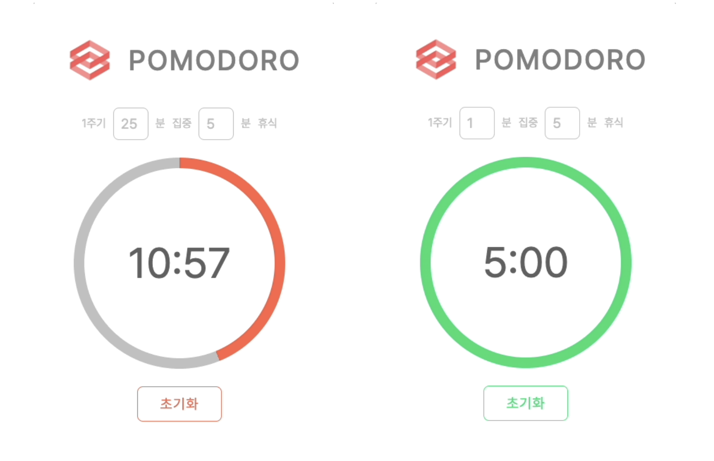

## 결과물

## 개요

- 뽀모도로 타이머 자주 사용하는데 직접 만들어보자!
- 배울점

  - 간단한 타이머 조작 방법
  - 원형으로 줄어드는 게이지 UI CSS로 구현하기
  - context API 익숙해지기(실패!)

  - 집중시간 휴식시간 입력(기본값 25분 집중, 5분 휴식)

 

## 기능

- 시작버튼 누르면 카운트 다운 시작
- 카운트다운 중에는 시작버튼이 초기화 버튼으로 변경
- 초기화 버튼 누르면 타이머만 초기화 되고 유저 입력 내용은 유지
- 카운트 다운이 완료되면 알림음
- 이어서 휴식시간 카운트 다운
- 휴식시간 끝나면 알림음
- 종료되면 초기화 상태
